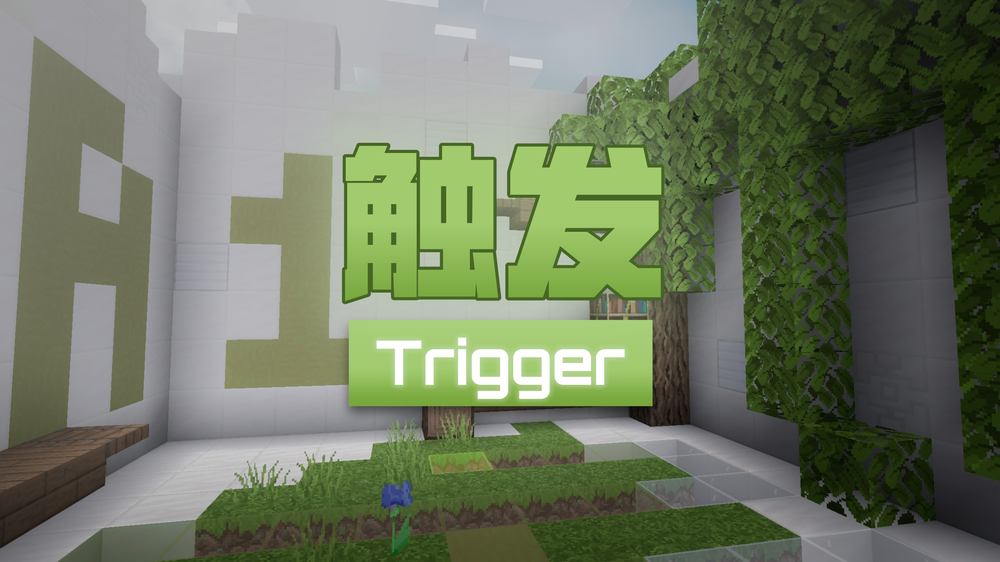

# 
## ◎更新日志

使用了新的函数架构重置了原本的命令系统，并且重新设计大部分的难度2和难度3关卡，增加了作者的NPC形象，完全支持了多人合作游玩，更新幅度巨大，故重新上架作为新的一张地图资源。

---

## ◎写在前面

- 我不是美丽的花朵，不是甘甜的果实，我是**o绿叶o**。本图属于**二字十部曲**系列的第三作；第二作**旋转**之前参加过相关活动，第一作**深坑**为代投，以上作品待优化后重新上架。
- 本图为了纪念跑酷和小游戏作者**风吹麦浪**而作。我在这里，等你回来。后续作者在黑历史里找到了他的联系方式，总算是大团圆。
- 另外，感谢**一只卑微的量筒、大只毛茸茸的鸽子、狂野巴豆、小飞侠、lanos212、Ender5207541、Echeng、幻光溢彩、墨痕、ProjectXero**的地图测试，感谢**一只卑微的量筒、ProjectXero、6g3y、野鲤、土豆泥92**的命令、建造、贴图等技术支持，感谢**极筑工坊**的帮助。
- 感谢您的下载与游玩。如果您是实况主，感谢您的录制。

---

## ◎注意事项

- 主要玩法：多合一的玩法创新式解密闯关。

主线分为A-F六种类型的关卡，每种类型分为1-3的难度，难度2-3为支线，随着难度提升，玩法也在不断变得多样化。

主线X为最终主线，为A-F的混合玩法，玩法之间环环相扣，较为困难。

获得信物来解锁奖励关，探索关卡内场景以开启隐藏关。

- **配置需求：中等偏上，比较低配的设备可能会出现发热、卡顿等情况**
- **游玩时间：速通约40分钟，正式游玩可能约1.5小时及以上**
- 游玩路线推荐：主线A1-F1→支线A2-F3→奖励关→主线X与隐藏关

---

## ◎下载链接

网盘

- [123云盘](https://www.123684.com/s/wIwKTd-kua6d "提取码:6Pa7")
- [蓝奏云](https://wwum.lanzoub.com/b0180j3na "密码:Leaf")

各大论坛或平台
- [GitHub](https://github.com/GreeLeaf2580/Trigger)
- [苦力怕论坛](https://klpbbs.com/thread-159914-1-1.html)
- [TITAIKE](https://www.titaike.cn/6649.html)
- [MCPEDL](https://mcpedl.com/trigger/)
- [网易中国版资源中心](https://resource-minecraft.h5.163.com/#/detail?uid=2156009524&id=4678791372825514220) *（搜索地图名：触发+，组件码：2351523）*
