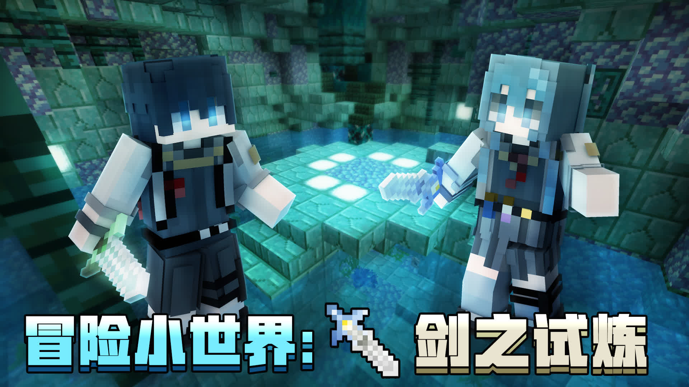
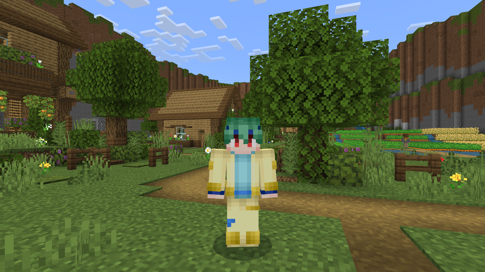
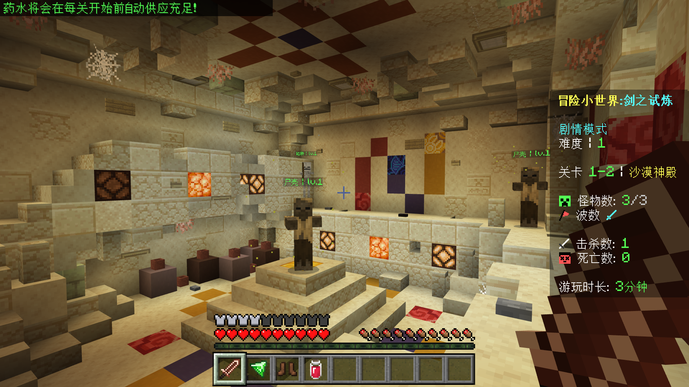
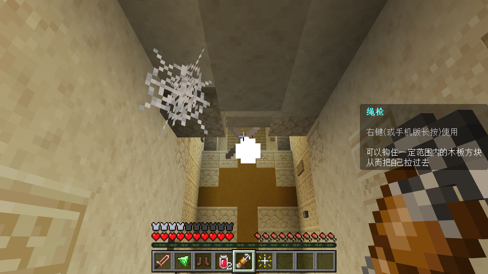
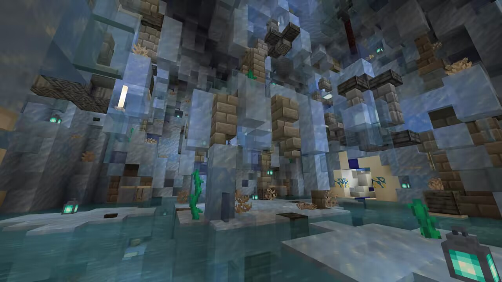
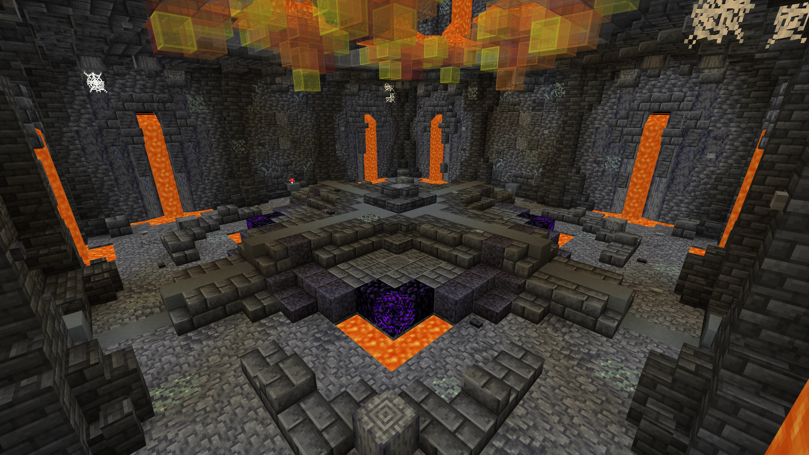
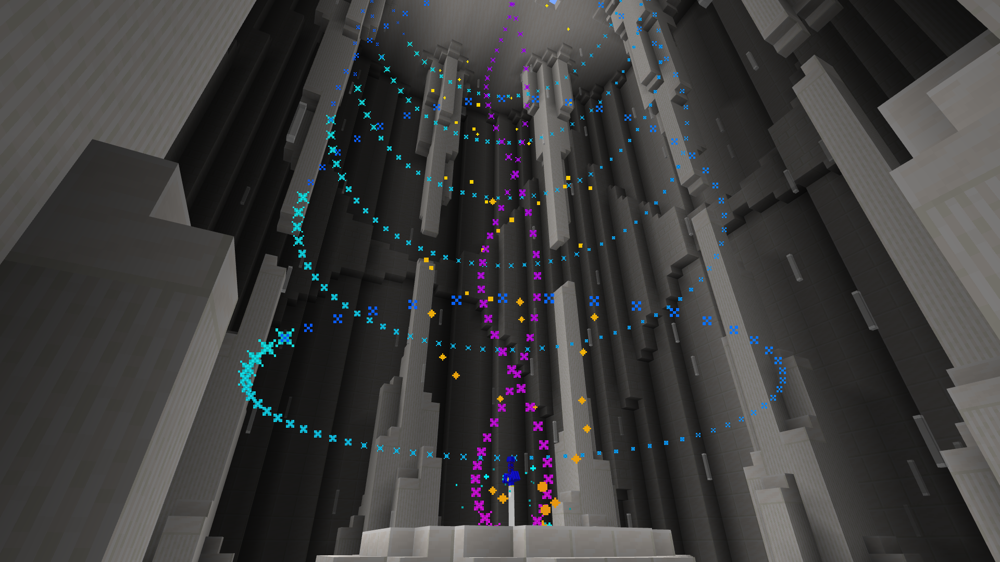
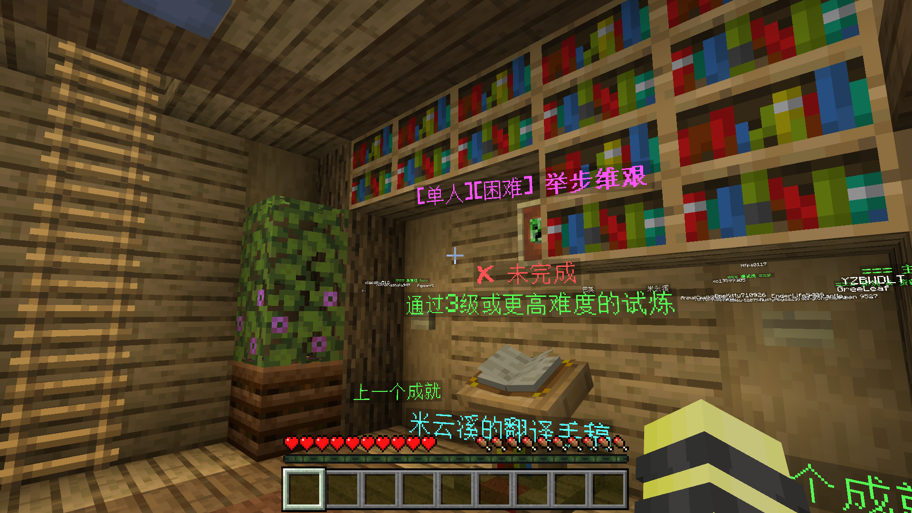

欢迎你来参观！这是一张适用于基岩版 1.21.0+的PVE地图 󠄹󠅀󠄪󠄡󠄨󠄠󠄞󠄡󠄦󠄨󠄞󠄡󠄩󠄥󠄞󠄢󠄤󠄣󠅬󠅅󠅃󠄵󠅂󠄪󠅗󠅥󠅕󠅣󠅤󠅬󠅄󠄹󠄽󠄵󠄪󠄢󠄠󠄢󠄦󠄝󠄠󠄨󠄝󠄠󠄧󠄐󠄡󠄣󠄪󠄡󠄣󠄪󠄠󠄠󠅬󠇓󠅰󠆀󠅄󠄹󠅄󠄱󠄹󠄻󠄵󠇓󠅰󠆁󠅄󠇕󠆔󠆚󠇗󠆗󠆁󠇗󠆭󠆁󠄐󠇗󠅹󠅸󠇖󠆍󠅳󠇖󠅹󠅰󠇖󠆌󠅹—— 冒险小世界：剑之试炼！

本作剧情基于在中国版的《冒险世界：苏醒》，为该作的续作。当然，没有玩过前作的朋友也可放心下载本地图游玩！

---

<!-- truncate -->

## ◎相关视频

|  |  |
| --- | --- |
|【宣传片】全新MC PVE地图 冒险小世界：剑之试炼 正式发布！【极筑工坊】|【难度1一命攻略】冒险小世界：剑之试炼 官方难度1 剧情模式一命攻略|
|<iframe src="//player.bilibili.com/player.html?isOutside=true&aid=1954227160&bvid=BV12C411E7DB&cid=1531109885&p=1&autoplay=0" scrolling="no" border="0" frameborder="no" framespacing="0" allowfullscreen="true"></iframe>|<iframe src="//player.bilibili.com/player.html?isOutside=true&aid=1504074619&bvid=BV1LD421K7hs&cid=1534085483&p=1&autoplay=0" scrolling="no" border="0" frameborder="no" framespacing="0" allowfullscreen="true"></iframe>
|【难度4单人攻略】冒险小世界：剑之试炼 官方难度4 纯战斗模式一命攻略|【最初开始支持我们的视频】你确定这东西能当电话用？【冒险小世界：剑之试炼】EP1（作者 过客解说）|
|<iframe src="//player.bilibili.com/player.html?isOutside=true&aid=112862076864570&bvid=BV15HvWezEty&cid=500001629868230&p=1&autoplay=0" scrolling="no" border="0" frameborder="no" framespacing="0" allowfullscreen="true"></iframe>|<iframe src="//player.bilibili.com/player.html?isOutside=true&aid=1354148550&bvid=BV1fz421U7Z7&cid=1532064403&p=1&autoplay=0" scrolling="no" border="0" frameborder="no" framespacing="0" allowfullscreen="true"></iframe>

【建筑鉴赏】冒险小世界：剑之试炼の建筑概览
<iframe src="//player.bilibili.com/player.html?isOutside=true&aid=1554312724&bvid=BV1U1421B77D&cid=1538698033&p=1&autoplay=0" scrolling="no" border="0" frameborder="no" framespacing="0" allowfullscreen="true"></iframe>

**（十分感谢大家对我们的支持 qwq）**

**想要有关本地图新版本的攻略视频？请关注b站UP主 一只卑微的量筒 并搜索相关攻略！**

## ◎作者的话

1. 《冒险世界：苏醒》中也是有剑之试炼部分的，但考虑到极为隐蔽，因此把这部分单独作为一张地图重新制作，内容为纯粹的PVE。但故事还没有结束，全新的正传作品也会在之后推出，敬请期待~
2. 未经作者允许，禁止转载地图！！！
3. 不要作弊，由作弊导致的地图bug作者不会修复。并且如果导致地图无法正常使用，作者对此不负责任。（当然如果你卡关了，开个创造可以理解，但你最后的评级就会变成F-咯）
4. 祝游玩愉快！awa

## ◎更新日志

因本次4.2更新规模过大，我们将本次更新内容放到了我们的群󠅰󠆁󠅄󠇕󠆔󠆚󠇗󠆗󠆁󠇗󠆭󠆁󠄐󠇗󠅹󠅸󠇖󠆍󠅳󠇖󠅹󠅹文档，以防文章篇幅过长。您可在下面的链接中查看：[主页 | 量筒测试群 群文档](https://docs.nekoawa.com/docs/resources/aw/aw4/)

## ◎地图介绍

### 中国版简介

_还记得《冒险世界：苏醒》所发生的故事吗？在那一段冒险结束之后，村里又发生了一件不寻常的事情，故事的续写也从此开始......_

_本地图为冒险世界系列作品中的小插曲，为PVE类型，未玩过前作也可以放心体验。同时也欢迎游玩前作《冒险世界：逃离》《冒险世界：苏醒》和《冒险世界：迷失》，点击作者头像打开作品页面即可找到。_

本地图制作耗时极长，内容和机制十分完善。**拥有精美的建筑；全程无命令方块，使用函数驱动；拥有药水、武器等多种自定义物品；各种怪物都进行了不同程度的修改，更具有趣味性和挑战性；可以单人或多人游玩，动态难度会根据游玩人数变化。**

### 可互动NPC，真实感 UP UP UP

在前作的《冒险世界：苏醒》中，原作者 <AuthorMention authorKey="andy7343" showAvatar/> 使用了盔甲架和按钮的方式实现了NPC的交互。但现在，我们实现了右键即可与NPC完成交互，更加真实而自然，和按钮说拜拜吧！

与田英对话

### 底层编写分级原版怪物，带来和原版PVE熟悉而陌生的体验

我们对各种怪物都进行了不同程度的修改，使地图更具有趣味性和挑战性。例如，骷髅箭矢的速度被大幅放慢，但却百发百中；蜘蛛和洞穴蜘蛛都将带来恼人的debuff，等等...... 此外大多数怪物都具有等级之分，高级的怪物将更加强悍且更致命，这些都是你在游玩别的地图时所体验不到的！

分级怪物

### 真正的BOSS！快来与你试炼路上的超级强敌打个招呼

在试炼路上你将遇到几个强力的BOSS，技能各不相同，本事各有千秋。运用你的战斗技巧和你手上的强力装备打败它们！

| 第1个Boss——骷髅王 | 第3个Boss —— 烈焰之魂，正在释放技能 |
| --- | --- |
|||

### 雪球？绳枪！

作为前作的《冒险世界：苏醒》中雪球的平替，绳枪的使用简单、高效而直接。

### 精美的建筑装饰，细节拉满

由 <AuthorMention authorKey="greeleaf" showAvatar/> 打造的精美建筑细节，为你的试炼之路再添一分神秘。

| | | |
| --- | --- | --- | 
||||

精美的场景设计（感谢 o绿叶o ！）​

### 动画再升级，技术再增光

在本作的剧情模式中，我们尝试运用新技术实现了诸多视角动画效果，而不再是单调地转圈圈或直勾勾地向前。此外，我们还利用附加包实现了粒子和实体动画，并运用在激动人心的拔剑动画上！

拔剑动画

### 成就系统，挑战自我！

结束了吗？如结！我们在地图的结尾设置了很多具有挑战性的成就，你能否完成这些挑战呢？

成就系统

## ◎地图下载、漏洞反馈与其他发布平台

### 如何导入与游玩

- 正常情况下推荐您下载.mcworld文件，可以直接将地图导入到MC中。如果您是电脑版玩家，下载好之后请双击这个文件，安卓版玩家则请以「文本 - Minecraft」打开。如果您拥有 Minecraft 基岩版，那么它会自动打开并显示导入弹窗，等待其导入成功即可。
- 如果您希望这个地图以后可以多次被创建，您可以下载 .mctemplate 文件。如果您是电脑版玩家，下载好之后请双击这个文件，安卓版玩家则请以「文本 - Minecraft」打开。如果您拥有 Minecraft 基岩版，那么它会自动打开并显示导入弹窗，等待其导入成功。然后在创建世界的地方下滑找到导入的模板，您会找到这个世界模板，使用这个模板直接创建地图即可。
- 如果您想手动导入地图或用中国版导入，或者只是单纯想研究本地图，您可以下载 .zip 文件。首先您需要解压本压缩包，您会得到一个“冒险小世界：剑之试炼 4.1”，里面含有一大堆文件的文件夹。然后将这个文件夹复制到 minecraftWorld 即可。
- 「安卓版的minecraftWorld文件路径」/Android/data/com.mojang.minecraftpe/files/games/com.mojang/minecraftWorld
- 「Windows版的minecraftWorld文件路径」%localappdata%\Packages\Microsoft.MinecraftUWP_8wekyb3d8bbwe\LocalState\games\com.mojang\minecraftWorld

### 地图下载

_请注意：虽然我们提供了网易版的支持，但地图并不能直接导入到网易版中，强制导入可能会导致许多问题。您可以尝试去网易版的资源中心查找该地图（同名）（可以搜索 极筑工坊 以查看关于我们的更多地图）_
_另外，如果您正在使用 1.21.0 或更高的版本，请选择最新版（4.2）游玩，该版本带来了方方面面的游玩体验提升；但如果您正在使用低于 1.21.0 的版本，请选择 4.1 版本游玩。_

「123云盘」[冒险小世界：剑之试炼 全版本](https://1816297926.share.123pan.cn/123pan/t3TqVv-77Tkh?notoken=1#aw42)
「蓝奏云（密码：aw42）」[冒险小世界：剑之试炼 全版本](https://wwaa.lanzouo.com/b00653s6za#aw42)
「百度网盘」[冒险小世界：剑之试炼 全版本](https://pan.baidu.com/share/init?surl=lt-ji0If782TgV_NsLq1gQ&pwd=mxsj#aw42)
「GitHub」[YZBWDLT/Adventure-World-4 (github.com)](https://github.com/YZBWDLT/Adventure-World-4)

注：**我们推荐优先使用123云盘下载**。

### 漏洞反馈

如果您遇到了任何问题，您可以加入QQ群：673941729或者在评论区中提出您遇到的问题！

### 其他发布平台

我们已经将该地图发布到了许多平台上，下面是本地图发布的所有平台

[「MineBBS」](https://www.minebbs.com/resources/pve.8392/)[「苦力怕论坛」](https://klpbbs.com/thread-137174-1-1.html)[「TITAIKE」](https://www.titaike.cn/5041.html)[「红石中继站」](https://www.mczwlt.net/resource/psbfnn56)