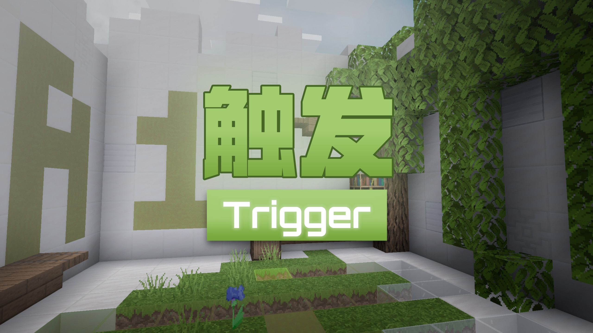
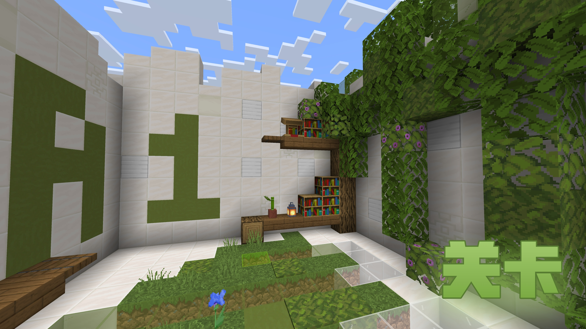
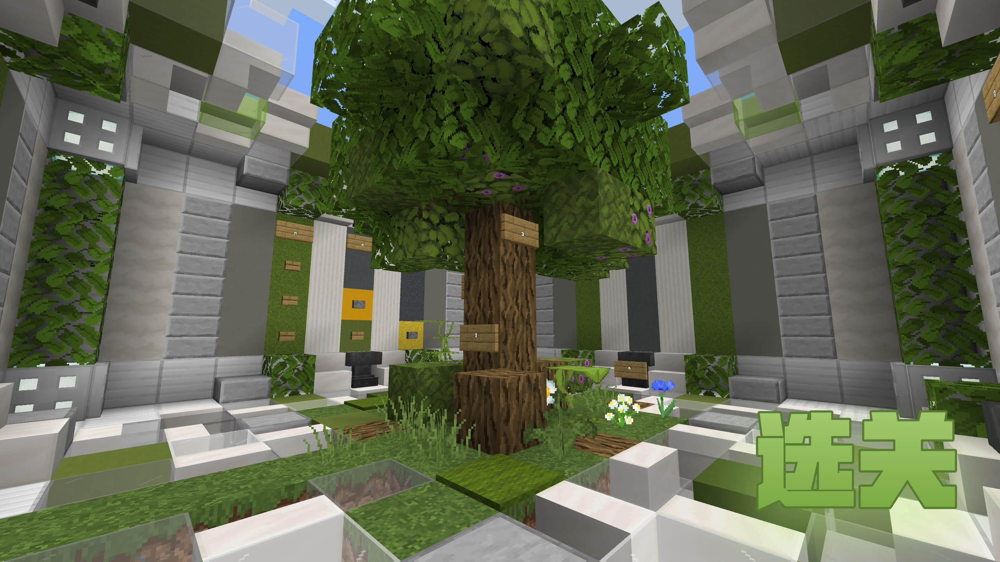
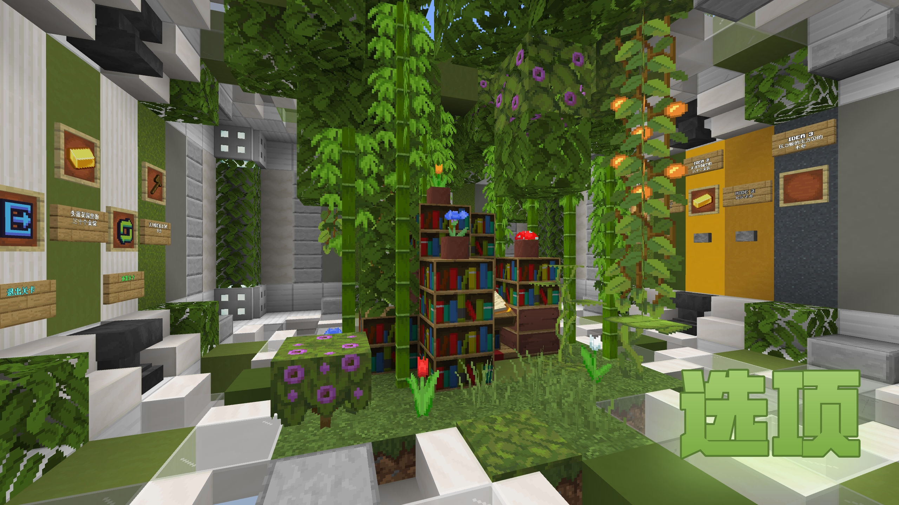
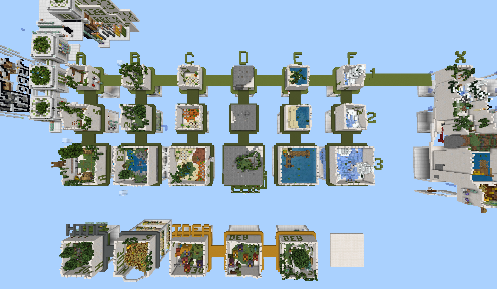

递进式创新解密的基岩版地图，完全支持多人合作游玩

---

<!-- truncate -->

## ◎相关视频

| 新版攻略 | 宣传片+旧版攻略 |
| --- | --- |
|<iframe src="//player.bilibili.com/player.html?isOutside=true&aid=114258310332566&bvid=BV1rbZWYWE47&cid=29172633513&p=1&autoplay=0" scrolling="no" border="0" frameborder="no" framespacing="0" allowfullscreen="true"></iframe>|<iframe src="//player.bilibili.com/player.html?isOutside=true&aid=898667536&bvid=BV1BN4y1j7QJ&cid=780859300&p=1&autoplay=0" scrolling="no" border="0" frameborder="no" framespacing="0" allowfullscreen="true"></iframe>

<!-- ## [EN](./README_EN.md "English") | [ZH_CN](./README.md "简体中文") -->

## ◎更新日志

使用了新的函数架构重置了原本的命令系统，并且重新设计大部分的难度2和难度3关卡，增加了作者的NPC形象，**完全支持了多人合作游玩**，更新幅度巨大，故重新上架作为新的一张地图资源。

---

## ◎写在前面

- 我不是美丽的花朵，不是甘甜的果实，我是**o绿叶o**。本图属于**二字十部曲**系列的第三作；第二作**旋转**之前参加过相关活动，第一作**深坑**为代投，以上作品待优化后重新上架。
- 本图为了纪念跑酷和小游戏作者**风吹麦浪**而作。我在这里，等你回来。后续作者在黑历史里找到了他的联系方式，总算是大团圆。
- 另外，感谢**一只卑微的量筒、大只毛茸茸的鸽子、狂野巴豆、小飞侠、lanos212、Ender5207541、Echeng、幻光溢彩、墨痕、ProjectXero**的地图测试，感谢**一只卑微的量筒、ProjectXero、6g3y、野鲤、土豆泥92**的命令、建造、贴图等技术支持，感谢**极筑工坊**的帮助。
- 感谢您的下载与游玩。如果您是实况主，感谢您的录制。

---

## ◎注意事项

- 主要玩法：多合一的玩法创新式解密闯关。

-主线分为A-F六种类型的关卡，每种类型分为1-3的难度，难度2-3为支线，随着难度提升，玩法也在不断变得多样化。

-主线X为最终主线，为A-F的混合玩法，玩法之间环环相扣，较为困难。

-获得信物来解锁奖励关，探索关卡内场景以开启隐藏关。

---

- **配置需求：中等偏上，比较低配的设备可能会出现发热、卡顿等情况**
- **游玩时间：速通约40分钟，正式游玩可能约1.5小时及以上**
- 游玩路线推荐：主线A1-F1→支线A2-F3→奖励关→主线X与隐藏关

---

## ◎下载链接

:::danger
本地图为基岩版地图，地图文件为.mcworld或.mcworld.zip，适用于Minecraft国际版。

其中.mcworld文件的导入方法对于windows设备 直接打开即可，对于安卓设备 下载后“用其他应用打开”->“Minecraft”->“仅此一次”

.mcworld.zip文件的导入方法，可以直接删去.zip后缀保留.mcworld后缀，再按照.mcworld导入即可。再麻烦一些需要将文件解压到游戏的minecraftWorlds目录下，该目录位置windows设备和安卓设备不相同。

参考链接(https://www.titaike.cn/tutorial)
:::

### 各大平台

| | | | | |
| --- | --- | --- | --- | --- |
|国内|[苦力怕论坛](https://klpbbs.com/thread-159914-1-1.html)|[MineBBS](https://www.minebbs.com/resources/11303/) |[TITAIKE](https://www.titaike.cn/6649.html)|[网易中国版资源中心](https://resource-minecraft.h5.163.com/#/detail?uid=2156009524&id=4678791372825514220 "搜索地图名：触发+，组件码：2351523")
|国际|[**GitHub Releases(推荐)**](https://github.com/GreeLeaf2580/Trigger/releases)|[MCPEDL](https://mcpedl.com/trigger/)|[Planet Minecraft](https://www.planetminecraft.com/project/trigger-6600634/)

### 测试群获取

欢迎加入[极筑 · 量筒地图测试群](http://qm.qq.com/cgi-bin/qm/qr?_wv=1027&group_code=673941729)，从群文件中获取

### 网盘

[123云盘](https://www.123684.com/s/wIwKTd-kua6d) 提取码:6Pa7

[蓝奏云](https://wwum.lanzoub.com/b0180j3na) 密码:Leaf