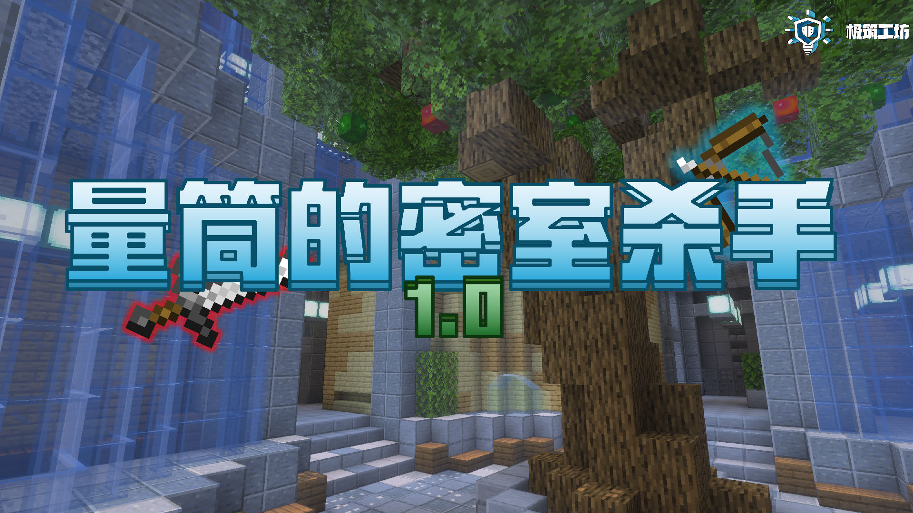
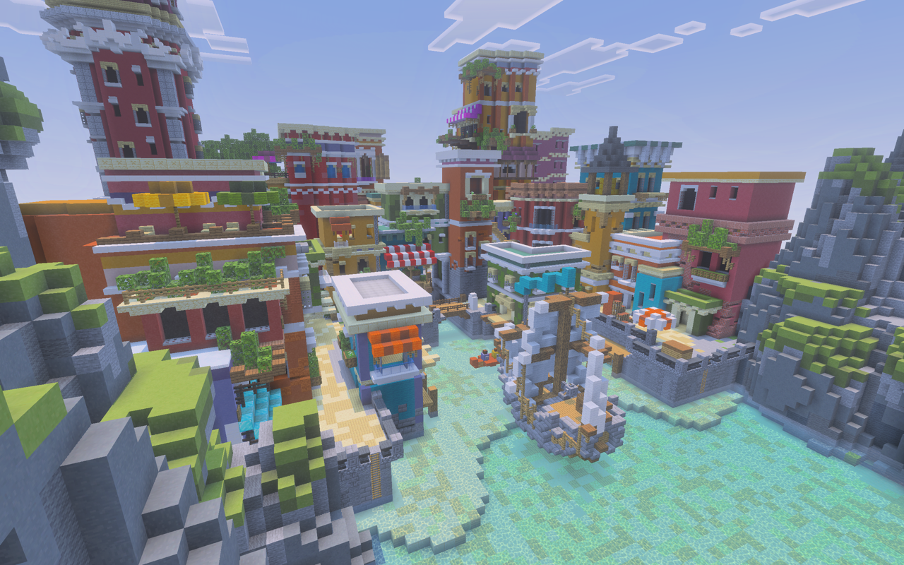
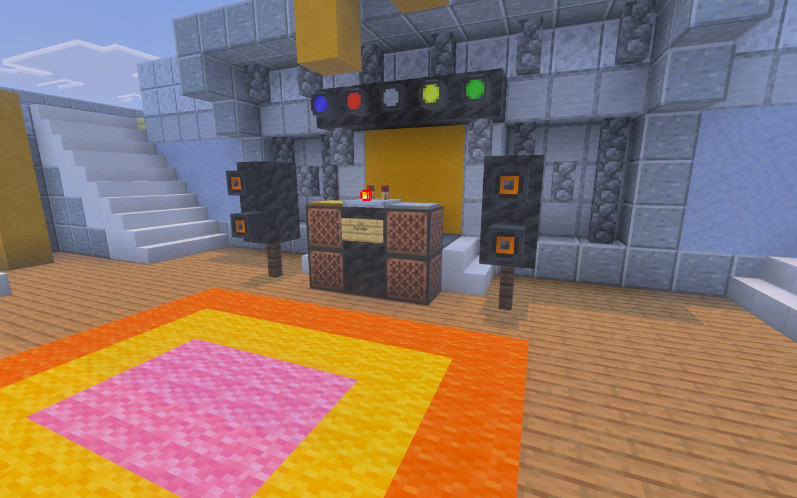
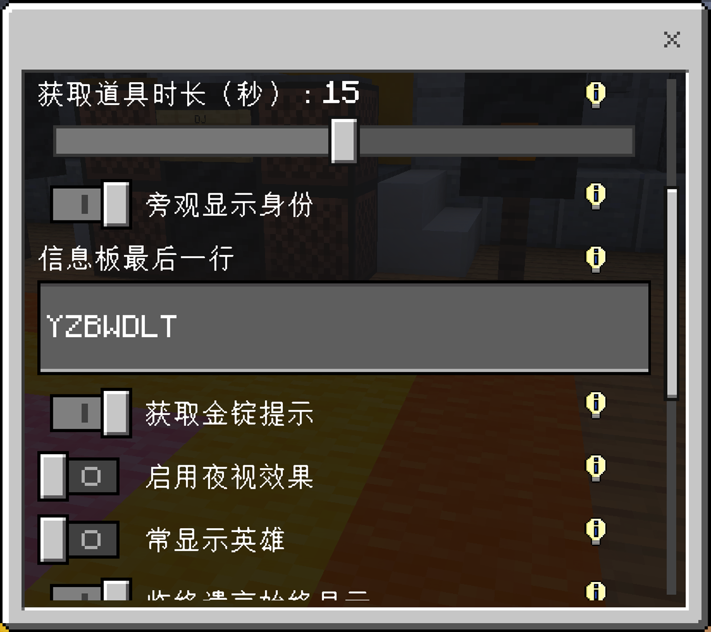
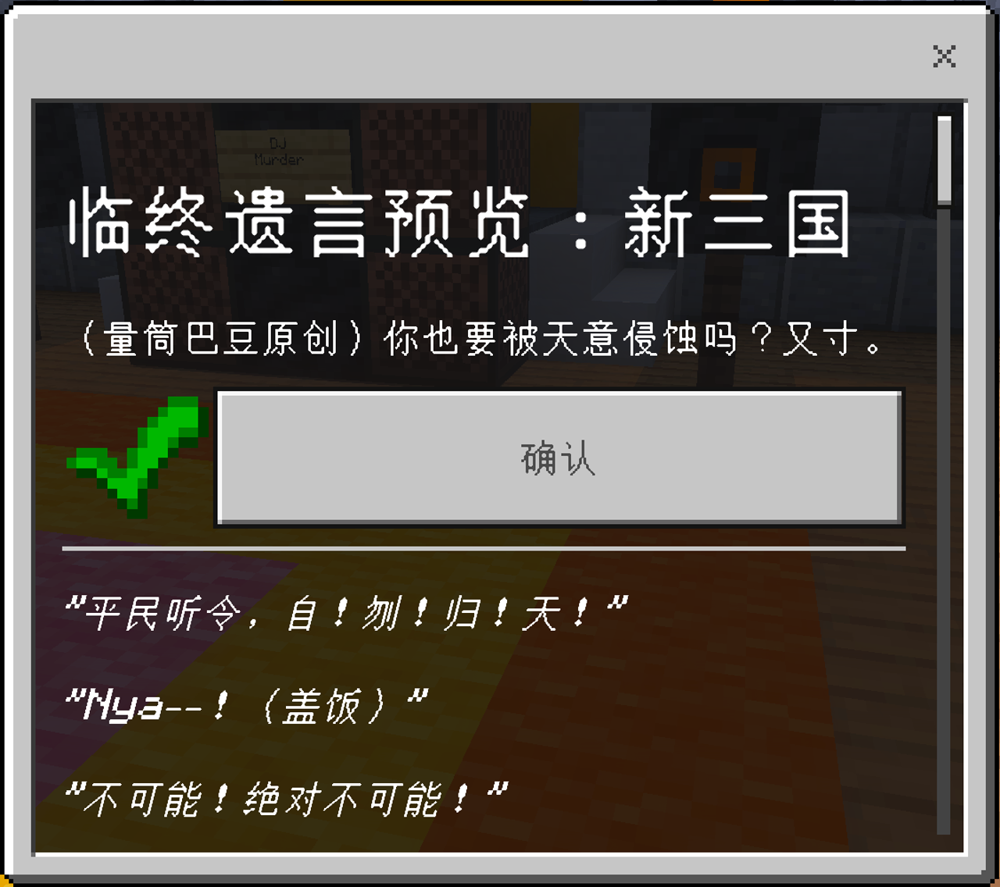
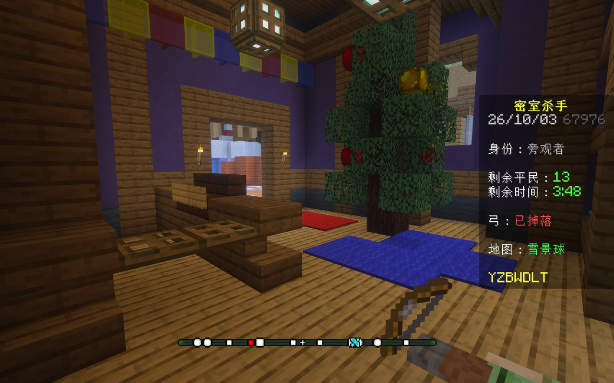

欢迎参观！我们最近高度还原了 Hypixel 的密室杀手！如果你喜欢玩密室杀手的话，欢迎来下载本地图！

---

<!-- truncate -->

## ◎作者

**作者** | 一只卑微的量筒

**出品** | 极筑工坊

**测试员** | 狂野巴豆（Andy7343）、文雨（KrisWenYu）、南瓜汁（PumpkinJui）、鸽子（PigeonKI）等 42 人（详情见 [制作人表 | 量筒测试群 群文档](https://docs.nekoawa.com/docs/resources/mm/credits)）

**特别鸣谢** | 珂朵莉（Tetrisoo），感谢珂朵莉的赞助和对本项目的超大力支持！

## ◎密室杀手规则

**密室杀手（Murder Mystery）** 是 Minecraft 的一个常见的小游戏玩法。游戏中一共有 3 种身份：平民、侦探、杀手。

在游戏中，一共有 3 种身份：

- **平民**：躲避杀手的追击，尽可能在规定时间内活下来。
- **杀手**：在规定时间内杀光所有其他玩家（包括平民和侦探）。
- **侦探**：杀死不断杀人的杀手。如果侦探被杀，则会掉落弓，其他平民捡起弓后可以变为侦探。

不同的地图或服务器，密室杀手的机制可能会有所不同。本地图着重还原了 Hypixel 的密室杀手的各种机制，包括密室杀手的基本玩法、飞刀、金锭生成等核心机制，并还原了 Hypixel 至今所有的地图。

## ◎地图简介

### 畅玩 12 张已适配地图、和总计 31 张地图！

Hypixel 密室杀手一共有 31 张地图（包括 2 张时令地图和 7 张已废弃的 V1 地图），每张地图都拥有自己独特的功能，因此全适配难度较大。我们这次挑选出了 12 张地图进行适配，还原了其所有功能！包括这些地图的陷阱、神秘药水、传送门、水肺药水、过山车、鬼屋门等等。欢迎大家自行尝试！

地图：港口小镇（San Peratico）

_已适配地图列表：总部（Headquater）、图书馆（Library）、水族馆（Aquarium）、高坠塔（Towerfall）、港口小镇（San Peratico，包括 V1）、阴森庄园（Spooky Mansion，包括 V1）、暗景秋色（Darkfall）、档案馆（Archives）、Hypixel 游乐园（Hypixel World）、复活节游乐园（Easter World）。_

此外，其他 19 张地图并不是完全不能玩的，我们仍然保留了对这些地图最基本的功能适配，所以这 31 张地图大家可以放心游玩！

### 严格打磨的细节，高度还原 Hypixel

我们在 Hypixel 进行了超多轮实地考察，对不少机制都进行了深入研究，部分文本、方块细节等更是像素级还原！例如，被其他玩家杀死后，会生成一具尸体；当飞刀击中玻璃板后，会穿过玻璃板并产生裂纹，等等。

值得注意的是，我们在地图中还首次引入了自定义头颅。Hypixel 的建筑师们非常喜欢用自定义头颅，他们足足在 31 张地图中用了 300 多种头颅！然而，我们的 o绿叶o（GreeLeaf）、南瓜汁（PumpkinJui）、狂野巴豆（Andy7343）不畏困难，直接在地图内实装了这 300 多种头颅。

游轮中的音响

此外，为了游戏体验，我们还首次引入了方块形式的画——可以保证玩家无论如何不能破坏掉画。

### 高度自定义化的体验——设置、临终遗言、主动旁观

我们在本地图中依然引入了设置选项，并引入了将近 30 项管理员设置，大幅度丰富你的游戏体验！你完全可以通过我们提供的设置实现包括但不限于以下玩法：

- **单挑模式**：两人时即可开启游戏！
- **疾速模式**：金锭生成拉满、侦探弓冷却和杀手飞刀冷却拉到 0，速战速决！
- **加时模式**：游戏时长拉低，但杀死杀手有加时
  
  游戏时设置 UI

此外，我们还开放了两项玩家设置。一项是**临终遗言（Last Words）**，可以在你死亡后在尸体上方生成一条临终遗言。我们准备了 14 条 Hypixel 的原版遗言和 2 条我们的自创遗言！

临终遗言 UI 确认界面

另一项则是**主动旁观（Opt-Out Spectate）**，可以在开始游戏前就决定要不要加入游戏中。

### 新技术、新功能继续突破

在本次的地图开发中，我们继续全面使用了 ScriptAPI，做到了 0 命令，并且这次使用了 TypeScript 进行脚本的编写，大幅度提高了脚本编写的效率和游戏内的运行效率。此外，除了前文提到的自定义头颅技术和方块画技术之外，我们这次还率先使用了 Minecraft 官方在 26.40 就引入了的脚本定位栏！使用这种定位栏可以让我们自定义定位栏究竟该定位哪些玩家，哪些位置——哪怕这个玩家潜行，都可以显示！而且，你仍然可以在设置中更改定位栏工作的细节！

游戏内的定位栏

:::danger[注意]

如果你使用 26.40-26.50 版本，你可能会在退出重进服务器后遇到定位栏无法工作的问题，具体表现为无论如何不显示定位栏。这是由于狗草的基岩版的一个 bug 导致的，Mojang 已经在 26.60 修复了这个问题。如果你遇到了这个问题，请先确保此时你确实能够显示定位栏——一个最稳妥的办法是死亡后看定位栏是否显示，因为旁观玩家通常来说是能够显示定位栏的。如果确实认定了重新进入服务器后你不能够显示定位栏，请联系房主/服主，让他们使用 /reload 命令重置。这条命令可能会导致游戏重启，但不会导致设置重置。
:::

### 未来的更新计划

1.0 的发布并不是结束，只是一个开始！我们选择在今天发布，是因为今天是我们的工作室 极筑工坊 的 9 周年庆，并且我们评估该地图已高度可玩。显然，我们还有很多工作没有做，我们在后续的更新中会继续更新新的地图特性，并且引入新模式、新设置（包括飞刀皮肤、投掷物特效等都在我们的 TODO LIST 中）。等到中国版更新 26.40 时，我们还会将本地图同步到中国版！

如果你对本地图的后续感兴趣，欢迎关注我的 B 站账号：[一只卑微的量筒](https://space.bilibili.com/241650193)。也欢迎加入我们的 QQ 测试群：[673941729](http://qm.qq.com/cgi-bin/qm/qr?_wv=1027&group_code=673941729)！

## ◎地图下载

### 如何导入与游玩

下载我们所提供的文件后，可以直接将地图导入到MC中。如果您是电脑版玩家，下载好之后请双击这个文件，安卓版玩家则请以「文本 – Minecraft」打开。如果您拥有 Minecraft 基岩版，那么它会自动打开并显示导入弹窗，等待其导入成功即可。

[「GitHub Releases」](https://github.com/YZBWDLT/MurderMystery/releases)

**下载完之后，如果可以的话还请高抬贵手，在帖子评论区回复一条内容，以让我们的工作不至于石沉大海。感谢！**

我们更推荐下载 .mcworld 的版本。网盘链接里包含 .mctemplate 地图模板文件，导入地图模板后，您可以在「开始游戏 - 创建新世界 - 我拥有的」中找到本模板。通过地图模板文件，您可以在本地无限创建新地图，而不再需要重新导入。

[「百度网盘（提取码：ltmm）」](https://pan.baidu.com/s/19DHEdwJstTeIHphNSZdFTg?pwd=ltmm) [「123云盘」](https://1816297926.share.123pan.cn/123pan/t3TqVv-pZVah?notoken=1) [「NekoDrive」](https://app.nekodrive.net/home?path=cloudreve%3A%2F%2FvXgIe%40share)

**注意**：我们自己的云盘 NekoDrive 仅限提供下载，请勿随意进行注册！否则我们随时有权停用此链接和您在此网盘上的账户。

### 漏洞反馈

如果您遇到了任何问题，您可以在以下平台提出您遇到的问题！

- QQ 测试群：[673941729](http://qm.qq.com/cgi-bin/qm/qr?_wv=1027&group_code=673941729)，非诚勿扰，友好交流，本群拒绝不文明现象，违规者重罚！
- B 站：[一只卑微的量筒](https://space.bilibili.com/241650193) 相关视频评论区
- GitHub Issues：[GitHub](https://github.com/YZBWDLT/MurderMystery/issues)

其他发布平台

我们已经将地图发布在了其他多个平台上。您可以在其他平台的我的主页中找到我发布的内容：

[「MineBBS」](https://www.minebbs.com/resources/be.18469/)[「苦力怕论坛」](https://klpbbs.com/thread-174202-1-1.html) [「TITAIKE」](https://www.titaike.cn/9236.html)

地图已经开源至 GitHub，您完全可以在 GitHub 的仓库[「YZBWDLT/MurderMystery」](https://github.com/YZBWDLT/MurderMystery/issues)免费查看我们的源码。您甚至可以在我们的源代码的基础上做改动后再次发布而不经过我们的许可，但您必须保证同样公开源码，并且注明原作者，不可以在未注明原作者或未公开源码的情况下擅自发布，详情参见 GPL 协议。您可以在除中国版、苦力怕论坛、MineBBS、TITAIKE 之外的平台转载该地图，但必须保证注明原作者和本帖链接。

## ◎宣传片 & 其他视频

### 宣传片：我们在基岩版还原了 Hypixel 密室杀手！ | 量筒的密室杀手 1.0 宣传片

<iframe src='//player.bilibili.com/player.html?bvid=BV1idHa66EER&cid=42422042778&autoplay=0' scrolling='no' border='0' frameborder='no' framespacing='0' allowfullscreen='true'></iframe>

### 开发历程记录：量筒的密室杀手——1.0 - Exp 1测试（1）

在巴豆的这个合集中，记载了我们从第一个测试版到最后成品版本的所有测试记录视频。如果你感兴趣，可以看一看，或者也可以看我们提供的[全部版本更新日志]查看曾经的测试版是如何一路走来的。

<iframe src='//player.bilibili.com/player.html?bvid=BV1CLTb6gEMh&cid=39627981177&autoplay=0' scrolling='no' border='0' frameborder='no' framespacing='0' allowfullscreen='true'></iframe>

### 作者的话

1. 十分欢迎各位服主使用本地图开服，我们的地图支持使用原版的 BDS 开服，如果您可以确保您使用的服务端支持原版脚本，那么也可以使用对应的服务端开服。
2. 如果您要转载本地图，请务必注意遵守我们上文的规定——这非常简单，注明原作者和本帖链接就可以了。
3. 最后，感谢您的游玩！祝您和您的朋友游玩愉快，祝你躲过杀手的追击！
