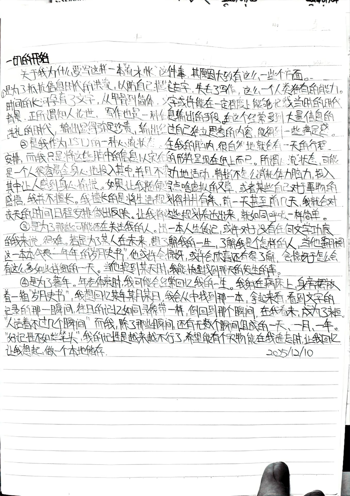

# 为什么要写流水账

---

:::note[前言]
&emsp;&emsp;这里的流水账指的是三次元一本本年度记录年度的本子，每一本按照时间轴记录我在某个时间点做了什么事，字体大小作为时间的占比，对当天的评价在时间轴的最下方。由于记录的只是每天的做了什么事，所以称作流水账，也通俗地可以理解为日记。我个人叫它流水账的原因，是大家认为的日记总是会附带记录自己的情绪，而我的只是单纯记录了我每天做了什么事，个人认为并不能称为日记。
:::

&emsp;&emsp;关于我为什么要写这样一本“流水账”这件事。其原因大致有这么一些个方面。

1. 为了抵抗信息时代的洪流，以防自己提笔忘字，失去了写作，这么一个人类独有的能力。时间的长河孕育了文字，从甲骨到简体。文字或许在一定程度上能够记载当时的时代背景，正所谓知人论世。写作也是一种信息输出的手段。在这个经常受到大量信息的洗礼的时代，输出显得弥足珍贵，输出经过自己独立思考的内容，能得到一些满足感。
2. 我作为ISTJ的一种心流状态。在我的脑内，很自然地就会有一天地行程安排，而我只是将这些脑中地信息以实在的形式呈现在纸上而已。个人认为，所谓“心流状态”，可能是一个人很容易全身心地投入其中，并且不费力的活动，特指不怎么消耗体力脑力，投入其中让人感到身心愉悦。我擅长的是将生活规划得井井有条，在前一天甚至前几天，我就会对这一天得时间安排产生反应 _（也就是知道自己在哪个时间该做什么）_。让我将这些规划表达出来， _（对我来说）_ 就如同呼吸一样简单。
3. 为了那些可能还在关注得我的人。出一本人生传记，或许对于没有任何文学功底的我来说，很难。若是为了某人在未来，想了解我的一生，了解我是个怎样的人，当他翻阅这一本本代表一年年的“岁月史书”，他或许会惊讶，或许会欣喜还有所了解，会惊讶于怎么会有这么多如此详细得一天。当他提到某天时，我能快速找到那天发生得事。
4. 为了暮年。年老体衰时，我可能会经常回忆我的一生。我躺在病床上，身旁摆放着一箱“岁月史书”，我想回忆某年某月某日，我会从中找到那一本，拿起来看，看到文字记录的那一瞬间，往日的记忆如同录像带一样，倒带到那个瞬间。在我看来，成为了永恒。

> 
 “人活着不过几个瞬间”————“久旱逢甘霖，他乡遇故知。洞房花烛夜，金榜题名时。” 

而我，除了那些瞬间，还有无数个瞬间组成的一天、一周、一月、一年。“好记性不如烂笔头”，我的记性是越来越不行了，希望能有个实物能在我遗忘时，让我回忆，让我想起。做一个本地存储。

> 
 “死亡不是终点，遗忘才是。” 

 ***编辑于  2026年9月9日*** 

---

_附带手写版本，记录于2024年册第一页_

