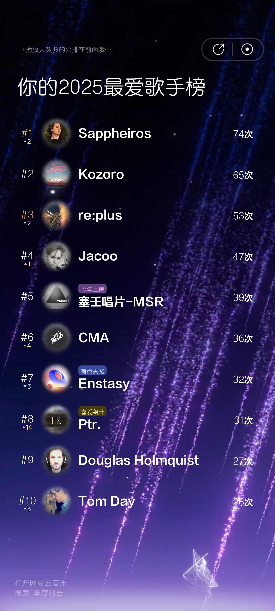
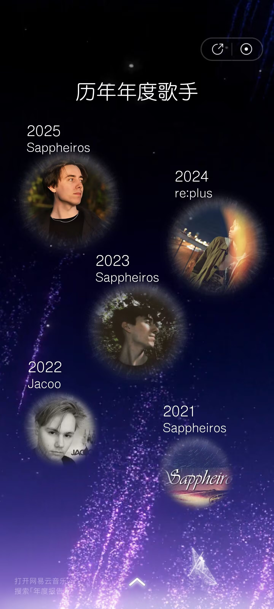
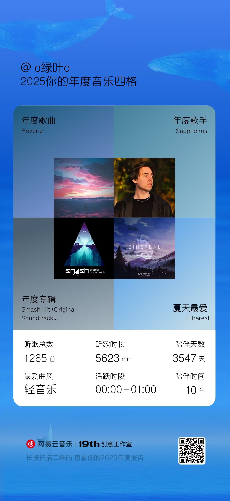
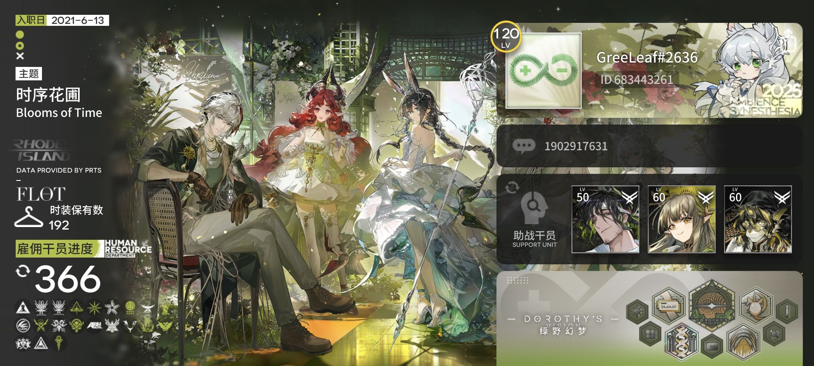
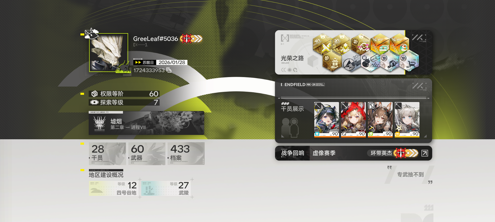
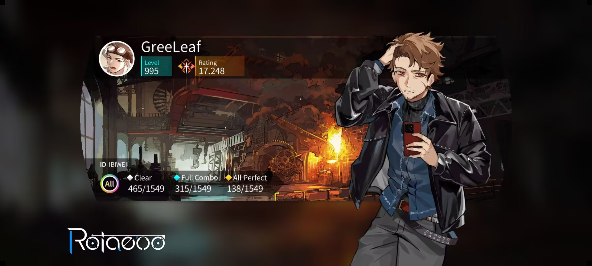
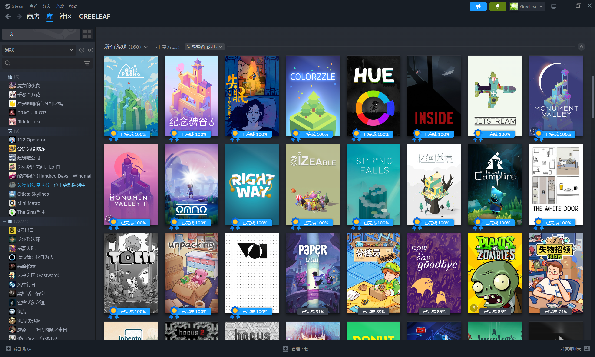

# 你好，但是……

---

## 首先，很奇怪，你是如何找到这里的。

&emsp;&emsp;要么是想切换深色模式，但是误触了旁边的空白区域。那你真的很幸运了，偶然能发现这个不同寻常的页面。

&emsp;&emsp;要么是我给你这个链接。但是我一般是不会给的，除非你是我信赖的人。

&emsp;&emsp;要么是`F12`页面检查，看到深色模式旁边有个空白的选择框，再跳转进来的。你是具有一些爬虫思维的人，善于发现这些细枝末节的东西。

&emsp;&emsp;要么是Github里看了我的源代码，发现这里还有一个隐藏的路径。那么你还挺有闲的，这东西真的会有人看吗……

> 
 "当你凝视深渊的时候，深渊也在凝视你:eyes:。" 

---

## 无论如何，请进吧……

&emsp;&emsp;既然拦不住你的探索欲，或者你想更多地了解我，下面是我的一些资料。

&emsp;&emsp;**GreeLeaf，枼，o绿叶o。男，汉族** *（可能是少数民族，但其实是因为父母没改民族导致高考错失20分）*，**2002年4月22日下午六点半出生于贵州省黔南州都匀市————一个十三线小县城。留守儿童至留守成人。💙ISTJ/INTJ，性格可能有些古怪。** 八字：壬午 甲辰 庚申 乙酉，日主庚金，五行：金、木、水、火、土都有，金偏旺、火为次用，水偏弱，喜水、木。 *（豆包算命的结果）*

:::note[为什么取这个名字？而且头像看着好复古老成。]
&emsp;&emsp;原因一我老家门口就是行道树，有荷花玉兰和香樟。原因二生日是🌏世界地球日。原因三老家比较有名的是毛尖茶。原因四比较喜欢自然一点的颜色，比如绿色。昵称的其他变体是从o绿叶o出来的，“枼”是“叶”最初的那个字，GreeLeaf是因为GreenLeaf一直重名，发现删去一个字母“n”并不影响发音。头像是早期听网易云的时候，看到动态里有音乐人转发了树叶的壁纸，感觉很不错就拿来用了，一直到现在。
:::

- ### Minecraft BedrockEdition

&emsp;&emsp;Minecraft BedrockEdition 我的世界基岩版独立开发者。 *(咕咕咕)* 前多玩盒子老玩家，主要做免费且高质量的 解谜、小游戏、跑酷地图，[作品博客](/blog)。做过[【场景跑酷】](/blog/timetracer7heat)【回声探路】[【触发】](/blog/trigger)，参与建筑的有[【冒险小世界：剑之试炼】](/blog/adventureworld4)【彩虹公路狂奔——巨人国度】。

|                             |                            |                           |
| --------------------------- | -------------------------- | ------------------------- |
|  |  |  |

- ### 纯音乐、轻音乐

&emsp;&emsp;一般比较喜欢听的风格有Chillstep、Chillout、Ambient、lofi、Jazz Hiphop、Post-Rock……，比较喜欢的音乐人有Sappheiros、Jacoo、Yal!X、Kozoro、re:plus、DJ Okawari、Seto、Tom Day……

|                                  | [【网易云主页】](https://music.163.com/#/user/home?id=265464707) |                                     |
| -------------------------------- | --------------------------------------------------------------- | ----------------------------------- |
|  |                                |  |

- ### Furry

&emsp;&emsp;福瑞控。但当前没有设定，因为个人认为用父母的钱去约稿有些不太好，等自己攒够钱了再约稿。玩过的fvn有【家有大猫】【笨蛋部】【漏夏】【战矛酒馆】……最早接触福瑞控圈子初中是从大叔圈里发现的，可以算是留守儿童童年父爱的缺失造成了现在这样。个人的xp主要是高壮、体型差、kiss。个人身高170cm，体重60(±5)kg，鞋码40

- ### 明日方舟和终末地

&emsp;&emsp;2021后6月高考后入坑的明日方舟，正好撞上多索雷斯假日水陈事件，开局新手池是闪灵和普通星熊，牢完了，现在120级老油条，欢迎助战、信赖、互送线索。终末地主要玩自然队、冰队、物理队、混伤队，休闲玩家，欢迎偷菜、卖货炒股、送快递、互送线索……

| 官服id：683443261                           | 终末地id：1724333953                     |
| ------------------------------------------- | ---------------------------------------- |
|  |  |

- ### 旋转音律Rotaeno

&emsp;&emsp;rating17.441，国际服全曲包。最早接触的音乐游戏是玩节奏大师和极品钢琴。之前玩过Pigros，但是因为后期谱面基本都是初见杀和背谱，没有多少兴趣了，就退坑了。个人感觉旋转音律的谱面丰富多彩，玩法上下限都很高，所以入坑了旋转音律。

| 国际服id：ibiwei                           |
| ------------------------------------------ |
|  |

- ### Steam:小众独立解谜游戏

&emsp;&emsp;Steam好友id：1224027170。主要玩一些清新优雅的休闲解谜小游戏。

- ### [QQ空间相册了解更多](https://user.qzone.qq.com/1902917631/photo/V53jcAqd3HFqVP3wnwIq3D6v7a2QmO1C/)
