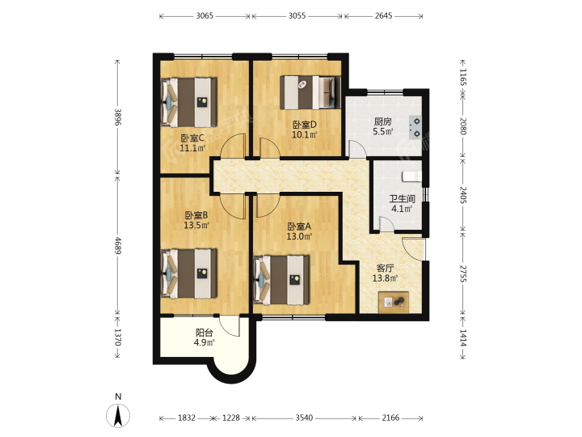
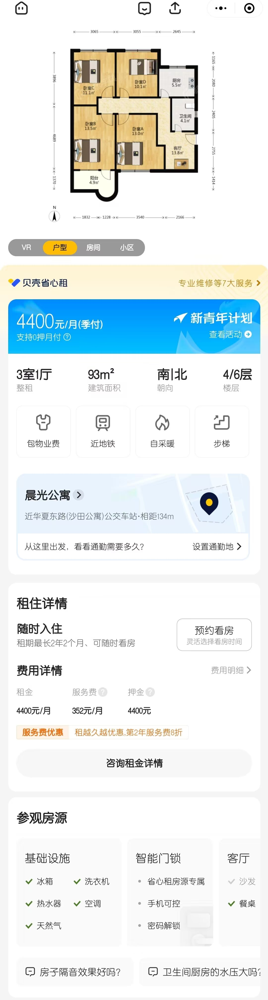
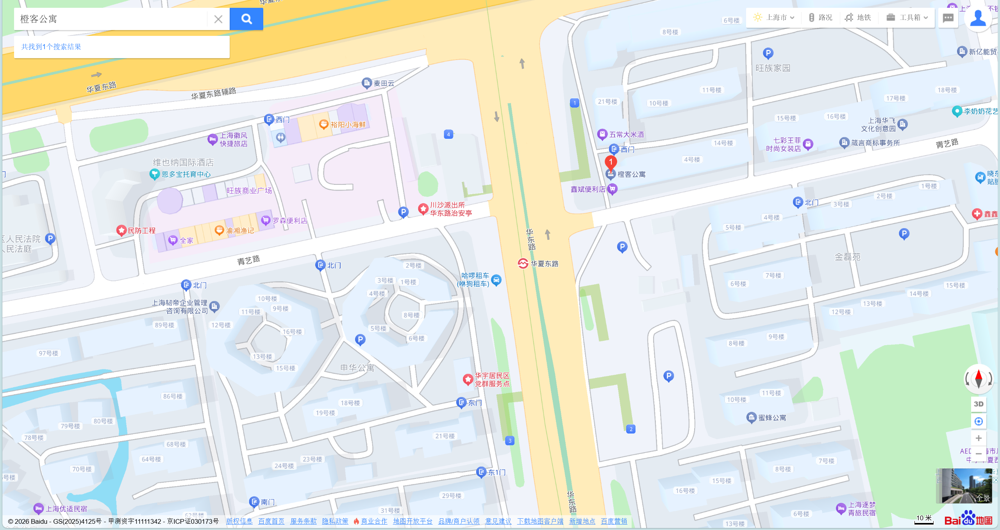
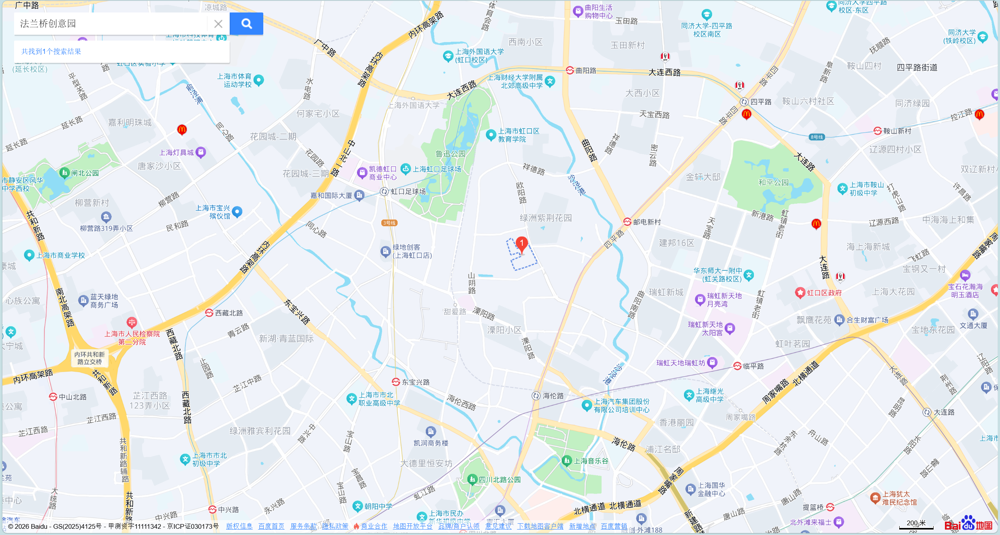
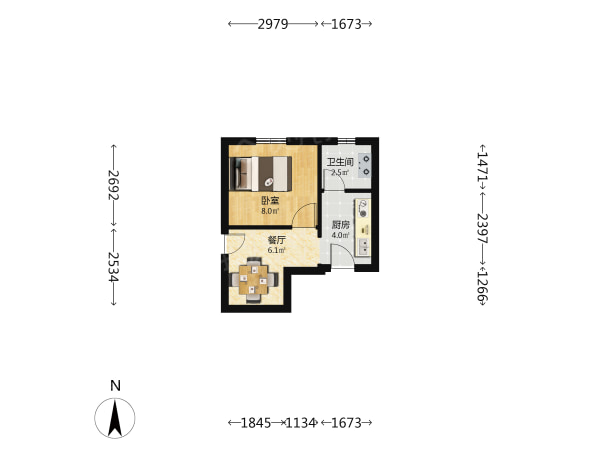
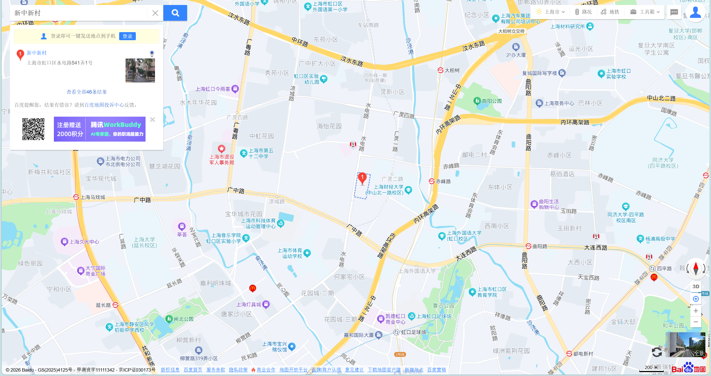
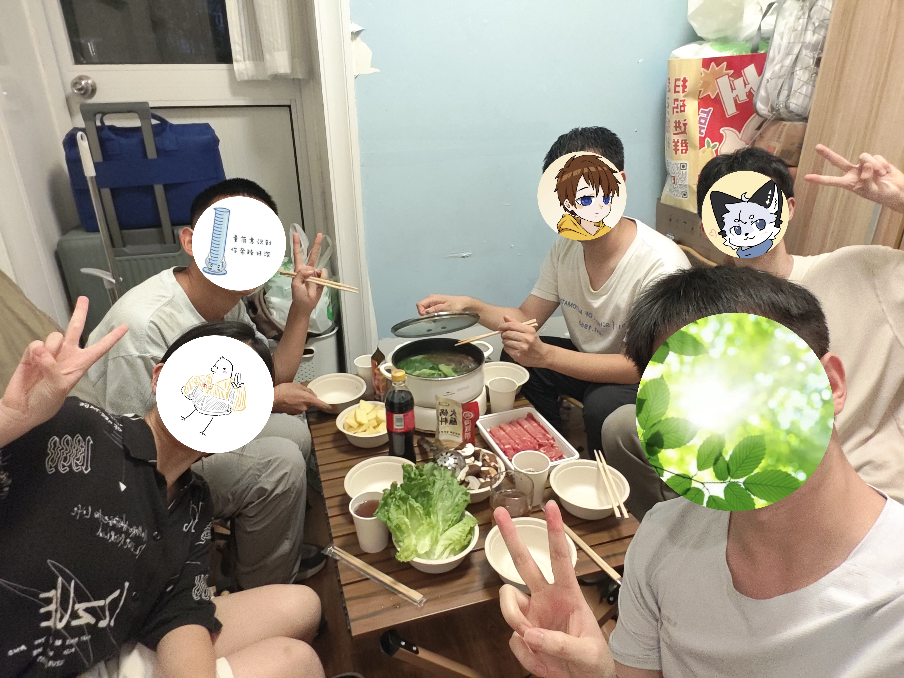

# 租房

| 租期 | 📍地址 | 租金 | 面积 | 水电燃 | 额外费用 | 交通 |
| ------------------ | :------------------------------------------------------------- | --------- | ------------------ | :----------------------------------------: | ------------------------------- | ------------------------------------------- |
| 2024年6月2025年6月 | 上海市浦东新区华夏东路1668弄23号**通居公寓**208室 | 1200元/月 | 12m2 | `⚡1.5元/度` `💧8元/吨` | ~`宽带50元/月`~ | `2号线` |
| 2025年6月2026年6月 | 上海市虹口区四川北路街道欧阳路196号**法兰桥创意园**15号楼217室 | 2500元/月 | 15m2 | `⚡1.5元/度` `💧8元/吨` `♨️38元/方` | ~`宽带50元/月`~ `管理费50元/月` | `10号线` `4号线` `3号线` `8号线` ~`19号线`~ |
| 2026年6月至今 | 上海市虹口区广中路街道水电路541弄**新中新村**7号楼101室 | 2600元/月 | 29.57m2 | `⚡(平0.6)(谷0.3)元/度` `💧4元/吨` `🔥3元/方` | `服务费208元/月` | `3号线` `8号线` ~`20号线`~ `公交` `自行车` |

&emsp;&emsp;_由于在大学时买了可以插卡的移动WIFI，办了一张流量卡，月租29元250GB流量和100分钟通话。后续都使用移动WIFI上网，所以宽带费用免除。_

## 租房经历

&emsp;&emsp;接近大四实习大三下期末，由于计算机专业，打算在张江靠近附近租房，而且租金需要低廉一些。在链家上比价了很多房子，甚至找了`积雨云海绵` `B-可靠南瓜头`一起合租，但最后因为四缺一，没有把那个民水民电4400的房子拿下，要是真拿下了就人均1100，在上海还是很滋润的，还是有点小遗憾的……最终还是自己租房。这算是我第一次自己去线下实地看房。

  
 晨光公寓链家详情页 

&emsp;&emsp;在住了快一个月的青旅之后，感叹住青旅的价格还是太高了，应该尽快找一个房子租住。（住了源深的大隐和老西门的深ke）

### 通居公寓（原橙客公寓）-上海市浦东新区华夏东路1668弄23号208室

<video controls width="30%" src="https://pub-9ffbc6f410d4452382ca0b754abeae80.r2.dev/autobio/lease/EastHuaXiaRdRaw.mp4"></video>

&emsp;&emsp;在链家上看到通居公寓这个房子的时候，我还是挺惊讶的，没想到周边房价都那么高了居然还有这种价格洼地的房子。不是链家自营的，就自己私下去通居公寓那个地方实地看看房了 _（跳单中介有些不好意思）_。无窗一居室，还是有些吓人的，不过当时实习工资就3000元，再加上家里有450元/周的生活费的支持，到也是能留下一些结余，就咬咬牙住了。

<video controls width="100%" src="https://pub-9ffbc6f410d4452382ca0b754abeae80.r2.dev/autobio/lease/EastHuaXiaRd.mp4"></video>

&emsp;&emsp;住这种无窗的房间确实是对人有一些影响。 **首先看不到阳光，对时间的认知有一些混乱，不知道现在是几点，得看电子设备上的时间才知道。其次，通风也很成问题。房间得24h开换气扇，而且容易墙角发霉，所以后期添置了除湿机。**

&emsp;&emsp;其次就是这个房子自己的问题。马桶是那种电动马桶，不是智能马桶，是搅碎后推测直接排放到较细的管道，比如厨房水槽的管道。之前丢了一些卫生纸进去，发现马桶堵住了，后来卫生纸都拿去外面丢，还让房东上门更换，但换来的还是这种马桶。

&emsp;&emsp;但也不能说就完全没有优点。首先是**租金便宜**，这个前文已经说过了，每个月算上水电大概要花费1500元。其次，**楼下就是地铁站和巴比馒头**，方便出行和上班。当时通勤大概半小时，外派到源深以后通勤大概一小时。上班的时候直接去楼下买一个肉包一杯豆浆5块钱解决早餐。上海地铁2号线也是一条东西向的地铁，通达度不错，除了比较拥挤和末班车结束比较早 _（只能在广兰路下车等公交回去）_，其他都挺好的。世纪大道、龙阳路、金科路、广兰路、唐镇、川沙都有商场，方便吃饭。去浦东机场只要半个小时。

### 法兰桥创意园-上海市虹口区四川北路街道欧阳路196号15号楼217室

&emsp;&emsp;后来因为考研的事情想着，去一个教育资源比较充足的区域。就考虑到虹口区，离杨浦那的新东方比较近。_（早知道应该换一家考研机构，新东方不包含专业课的线下课程，至少我在上海没发现，个人自控力为零还是觉得完全线下的课程能管住自己）_ 就在闲鱼上找虹口的房子，找到这个房子。

| 房东视频                                                  | 入住一段时间后的视频                                    |
| --------------------------------------------------------- | ------------------------------------------------------- |
| <video controls width="50%" src="https://pub-9ffbc6f410d4452382ca0b754abeae80.r2.dev/autobio/lease/FrenchRaw.mp4"></video> | <video controls width="100%" src="https://pub-9ffbc6f410d4452382ca0b754abeae80.r2.dev/autobio/lease/French.mp4"></video> |

&emsp;&emsp;**这个公寓感觉是酒店改装的，内部的陈设也很像酒店。** 门卡用的酒店房卡，电视也是酒店的电视，还有床头柜。后续我把两个床头柜摞在一起，变成一整个柜子。让房东把床移动到靠墙，能额外多出一些空间。衣柜是嵌入在卫生间旁边，加上移门当隔断。卫生间干湿分离，除了没有卫生间台盆。厨房餐桌是橱柜的柜门，需要的时候九十度翻转撑开，水槽有些小，初始的水龙头比较矮。桌子是柜子+可移动的桌板，比较扁长。我后续买了延长桌，把原来的桌子延长宽边到80cm。

&emsp;&emsp;房东让我选择房型，二楼朝北外窗2500元/月，4楼过道窗和天井内窗2200元/月，无窗2000元/月。之前还问过房东，从建筑外墙上看，为什么无窗那边好像是有之前有朝南的窗户，只不过用砖封起来了，房东回答那边窗对面是弄堂，弄堂的人投诉会看到他们房子里的陈设，所以就封上了，房东也想多赚钱。我之前住过了无窗的房间，有点阴影了，所以就选了外窗的房间。虽然房租翻了一倍，但是我把说为了考研能帮我报销。 _（实际上应该冷静一下，新东方的全封闭教学在嘉定，还是有点远的，最后没有经常在这个房子住，也就考研后住了半年。如果还在华夏东路，能为父母省更多钱，现在事后诸葛亮了。或者说应该早一点报名线下班，那确实有一些意义的，大家一定要先规划好都咨询好再做决策）_

&emsp;&emsp;**地段非常不错，位于四条地铁的交汇处，地铁交通非常便利。除了到地铁站这些地铁站有一些距离。** 步行大概都需要10分钟左右。个人非常喜欢上海地铁10号线。配色淡雅，直达上海虹桥，经过上海市区，自动驾驶很平稳，站内厕所很多。

&emsp;&emsp;**周边配套不错**。楼下有一家超市、顺丰、沪上阿姨。_（埋下伏笔）_ 附近的商场有虹口足球场的虹口凯德、临平路的瑞虹新天地、再远一点国际客运中心的白玉兰广场。距离北外滩非常近，骑车就到了。绿化有鲁迅公园和平公园。鲁迅公园门口的樱花不错，春季总会吸引很多人驻足拍照。不过鲁迅纪念馆一直在维修，想去一直没机会去。鲁迅公园里面的鲁迅墓有很多前来瞻仰的，不过贡品挺现代，有供奉辣条啥的（）。和平公园我会给出很高的评价，生态环境很不错，有图书馆、比较大型的儿童乐园，很适合闲逛。

鸽子和巴豆甚至来我这吃过一次火锅，难以想象这么小的厨房能吃顿火锅。

&emsp;&emsp;**但是这个房子是有不少缺点的**。每天凌晨，楼下顺丰会开始卸货，再加上我是外窗，所以会非常吵，我平时睡觉都戴着耳塞，有点担心吵到来我家做客的客人。隔壁也是比较吵的人，每个晚上都在和别人电竞，我躺床上能听得一清二楚。烟道串味，楼上炒什么菜我家都能闻到，让房东来处理也是没修好。卧室的灯具开关基本上坏完了，房东也没换。卫生间没有台盆，不方便直接洗漱。入住的时候蟑螂比较多，我买了拜耳用上了一个月基本上除掉了。油烟机有一天突然坏掉了，打开油烟机一直在异响，这个房东倒是修好了。入住前没有独立的洗衣机，用公共的洗衣机有些不太放心，自付300元买了二手的波轮洗衣机。

&emsp;&emsp;白天烟道串味，晚上电竞噪音，凌晨顺丰卸货，实在是有些受不了。趁着租约快到期，就在二六年五一的时候趁着淡季提前出去找了新的房子。

### 新中新村-上海市虹口区广中路街道水电路541弄7号楼101室

&emsp;&emsp;还是想在虹口住，在之前法兰桥附近找适合的房子。在链家上找到了这一间房子。

&emsp;&emsp;**个人认为是比较有性价比的一间房**。民水民电民燃，每月只要2600元，但是需要每月8%的服务费，也就是每月2800元，不过周围的房子都奔着3k往上去了。和之前的商水商电的房子每月水电300元差不多。面积好像比之前的房子大一倍，最左侧还附带一个小院子，有明显的功能区分割。1.8m的床，睡三个人应该没问题。

&emsp;&emsp;**周边配套还行**。比法兰桥稍微偏僻一点。3号线赤峰路、3号线8号线虹口足球场。附近除了虹口凯德，还有步行10分钟万泰广场。里面有盒马、好特卖、萨莉亚。附近还有从几个学校，小学中学大学都有。朝北的窗户对着的就是小区的公园设施。这个小区好多猫。

2026年9月12日量筒巴豆文雨鸽子在我家吃火锅

&emsp;&emsp;**缺点也是有的**。房子的旁边就是马路，可能会有一定的噪音。房间进门直接能把所有房间一览无余。去庭院的门不太结实，也就普通卫生间那种门，感觉有被盗的风险。一楼比较潮湿，除湿机大部分时间要24h开。而且隐私性不太好，给窗户装上了纱帘。上一任住户夫妻养猫，几乎把客厅的区域都给猫活动了，他们搬走后忘记提前叫链家的人进行消杀，入住一个月有跳蚤，咬得我腿上全是包。后续让链家上门消杀了两次，才终于消杀干净。1.8m的床，几乎把整个卧室都占满了，空间利用率比较糟糕，等有钱了（也许）会换成小一点的1.5m的床，再把客厅的柜子移动到卧室，解放客厅的空间。

## 租房好物

&emsp;&emsp;**皮尺**或者钢卷尺。主要用途：方便测量房间位置、家具的大小，以便于购买合适的新的家具。皮尺轻量小巧，还能用于测量一些身体的数据，但容易损坏，测量时需要拉直。钢卷尺测量时不需要拉直，但比较重，边缘有一些锋利，测量和回收时要小心，必要时可以作为武器使用（）。个人更倾向于购买皮尺。

&emsp;&emsp;**止逆阀**。适用于厨房水槽、浴室地漏、洗衣机下水。有些下水道即使有洄水湾还是反臭。用于解决下水道总是反臭的问题，也可以防范一些下水道的蚊虫。止逆阀非常便宜，基本上个位数一个。购买之前记得量一下 下水道的尺寸，主要是直径和深度，别到时候买过来安装不上去。至于流速的问题，浴室的地漏可能会有一些影响。推荐侧面开口的重力式止逆阀。

:::tip[你知道吗]

- 在厨房水槽滤网里放置一个，用锡纸搓成的小球，可以避免水槽滤网变得油腻。
- 烧烤用的烤肉夹子也很适合用于更换水槽滤网，不会脏手。实验室的丁腈手套也很适合用来搞卫生，避免手沾上洁厕灵或者污渍。

  :::

&emsp;&emsp;**伸缩杆**。小小一个，搬家能带走，不用打孔不破坏原有房屋结构。对于无创的窗帘杆、悬挂轻质杂物、晾衣服很好用。挂在小角落还能收纳足球。小型伸缩杆放在柜子里加点收纳筐或者木板还能当分层收纳架。大一点的伸缩杆，可以顶天立地，加一些小配件可以当灵活的置物架。

&emsp;&emsp;**马桶上方置物架/水槽上方置物架/洗衣机上方置物架**。

&emsp;&emsp;这些置物架能盘活一些平时用不到的空间，增加对应空间储物容量。引用卡门卡卡的原话：“你能用马桶上方的空间干什么，除了挂张画”。

|          | 马桶上方置物架     | 水槽上方置物架                   | 洗衣机上方置物架                         |
| -------- | :----------------- | :------------------------------- | :--------------------------------------- |
| 优点     | 卫生间收纳无中生有 | 杯子碗筷就近收纳，还能堆放小厨电 | 洗护用品往上放                           |
| 缺点     | 小心东西掉马桶     | 水槽光线被遮挡，洗碗时可能太暗   | 小心波轮洗衣机打不开，或者没空间放置物架 |
| 解决方案 | 平时盖上马桶盖     | 置物架下方加磁吸灯               | 提前测量选好合适高度                     |

&emsp;&emsp;卫生间的马桶上方确实是一个闲置的地方，我用了马桶上方的置物架，把清洁用品、药箱、日化囤货放在上面，能极大解决了卫生间完全没有收纳空间的窘境。但是有一个不太好的点，上完厕所记得把马桶盖盖上，免得置物架上面的东西掉到马桶里面去。

&emsp;&emsp;水槽上方置物架可以把杯子碗筷放在上面，就近收纳，也可以把一些厨房小家电放上去。但缺点是，使用水槽的时候，由于置物架遮挡，水槽会变得比较暗，可以在铁质置物架下方加一个感应磁吸灯，解决这个问题。 _（虽然我觉得，中国厨房的灯光设计都比较灾难，光源设计在顶上，做饭清洗时都会被身体投下来的影子挡住）_

&emsp;&emsp;洗衣机上方置物架可以把洗衣粉、洗衣液、消毒液放上去。但只是针对波轮洗衣机的情况，滚筒洗衣机不用这个置物架也行。缺点也是有的，购买洗衣机上方的多层置物架时，需要提前测量好多高，不然层板放不上去或者波轮洗衣机翻盖打不开。

## 搬家经历

| 起点                                | 终点                                | 日期       | 平台   | 费用 | 点评                      |
| :---------------------------------- | :---------------------------------- | ---------- | ------ | ---- | :------------------------ |
| 上海市浦东新区华夏东路1668弄23号    | 上海市虹口区四川北路街道欧阳路196号 | 2025/06/24 | 蓝犀牛 | 226  | 第一次搬家                |
| 上海市嘉定区南翔镇金昌西路1188弄    | 上海市虹口区四川北路街道欧阳路196号 | 202/12/10  | 蓝犀牛 | 181  | 考研培训后搬家            |
| 上海市虹口区四川北路街道欧阳路196号 | 上海市虹口区广中路街道水电路541弄   | 2026/06/10 | 蓝犀牛 | 272  | 第二次搬家-应该用中面包车，用了两次小面包车 |
